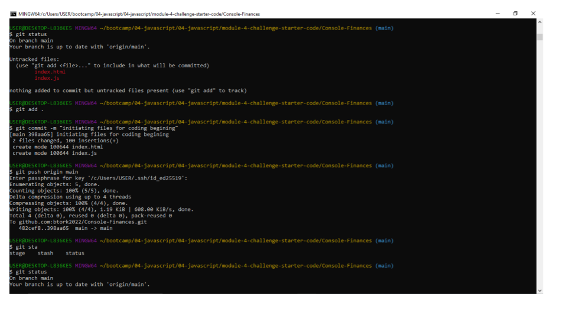
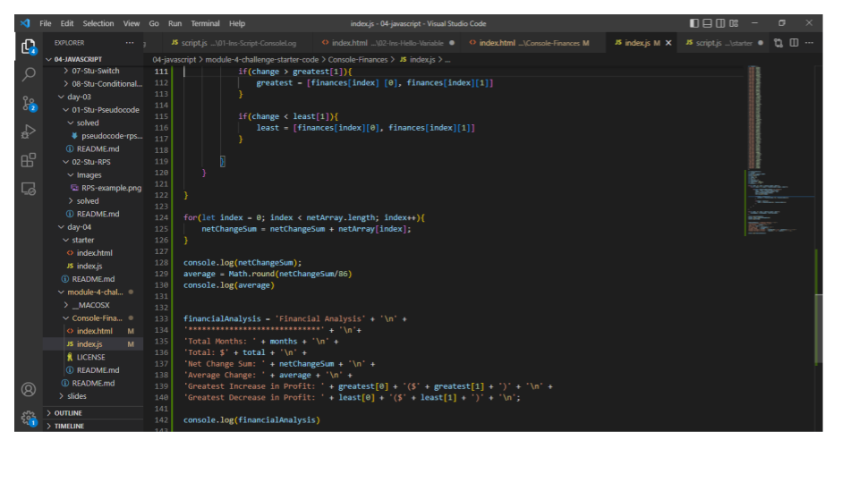

# Console-Finances

Financial analysis tool

## Description 

This work involved creating code for analyzing the financial records of a company. The design task motivation is for creating interactive tool with javascript for financial analysis.

### Links

#### Web address : 
https://btork2022.github.io/Console-Finances/

#### Github address :
https://github.com/btork2022/Console-Finances

## Installation

- Console-Finances repo was created on Github
- GitBash CLI was used for  git-commands to deploy the repo locally and for subsequent updates upload to the github cloud
- VScode application was used to create the html and javascript files as well as the file/folder structure

## Usage 

### Screenshots of Gitbash and VScode

## Credits

- Drew Hoang and Matthew Steffner for guidance

## License

MIT license

© 2023 btork2022 Confidential and Proprietary. All Rights Reserved.
